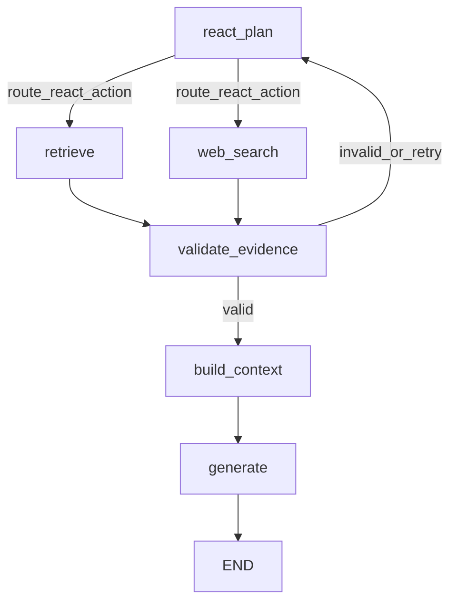

# DeepResearch RAG Agent

DeepResearch RAG Agent is a full-stack Retrieval-Augmented Generation (RAG) application that combines:

- Local paper retrieval from Qdrant
- Fallback web search for freshness and missing evidence
- A LangGraph ReAct-style workflow for controlled routing
- FastAPI backend and Next.js frontend

The system is designed to answer with evidence-backed citations and graceful fallback behavior when confidence is low.

## Core Capabilities

- Agentic routing with explicit nodes (`react_plan`, `retrieve`, `web_search`, `validate_evidence`, `build_context`, `generate`)
- Prompt-driven web-only intent detection (`requires_web`) in planner and reflection steps
- Temporal query handling for phrases like "last month" and "this month"
- Section-aware ingestion for full-text PDFs
- Debug endpoints with trace-level graph visibility
- Logfire instrumentation for API, node-level, Pydantic, and OpenAI telemetry

## Architecture

The LangGraph workflow in `backend/graph.py` is:

1. `react_plan`
2. `retrieve` or `web_search`
3. `validate_evidence`
4. Loop back to `react_plan` if fallback is needed
5. `build_context`
6. `generate`

This gives a deterministic control loop with LLM-assisted planning and reflection.

## Workflow Graph



## Repository Layout

```text
.
├── backend/
│   ├── main.py            # FastAPI API endpoints
│   ├── graph.py           # LangGraph state machine wiring
│   ├── nodes.py           # Agent nodes and routing logic
│   ├── configuration.py   # Model, token, env config helpers
│   ├── ingest.py          # PDF ingestion CLI
│   └── requirements.txt
├── frontend/              # Next.js app
├── docker-compose.yml     # Qdrant service
├── run-dev.ps1            # One-command local startup
└── run-dev.cmd            # Windows launcher
```

## Prerequisites

- Python 3.11+ (tested with 3.12)
- Node.js 18+
- Docker Desktop (for Qdrant)
- OpenAI-compatible API key
- Tavily API key (for web search)
