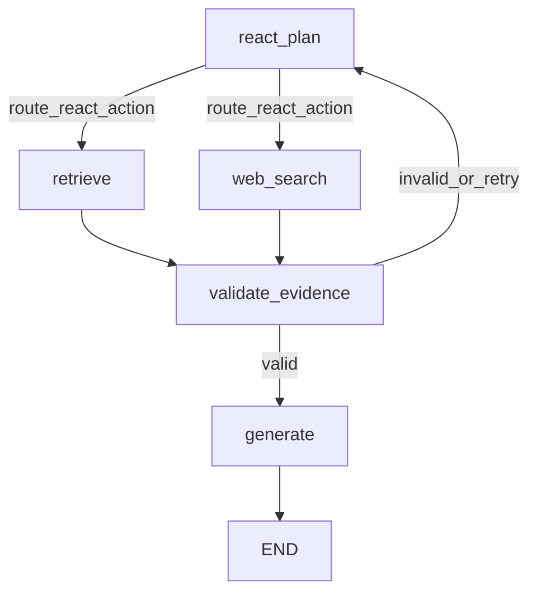

# DeepResearch RAG Agent

DeepResearch RAG Agent is a full-stack Retrieval-Augmented Generation (RAG) application that combines:

- Local paper retrieval from Qdrant for high-relevance domain context
- Fallback web search for freshness and missing evidence
- A LangGraph ReAct-style workflow for controlled routing, retries, and reflection
- FastAPI backend and Next.js frontend for end-to-end interaction

The system is designed for evidence-first answers: every response is grounded in retrieved context, citations are preserved through generation, and fallback behavior is explicit when local evidence is weak or incomplete.

## Core Capabilities

- Agentic routing with explicit nodes (`react_plan`, `retrieve`, `web_search`, `validate_evidence`, `generate`)
- Hybrid evidence strategy: local-first retrieval with controlled web fallback when evidence is insufficient
- Prompt-driven web-only intent detection (`requires_web`) in planner and reflection steps
- Retry-aware web query rewriting to avoid repeating weak search intents across attempts
- Source-balanced context assembly for final generation (local and web evidence)
- Section-aware full-text PDF ingestion with chunking and overlap controls
- Upload pipeline that extracts PDF text, derives metadata, and indexes section-level chunks in Qdrant
- Benchmark harness (`run_question_tests.py`) with LLM-based answer judging and report generation
- Logfire instrumentation for API, node-level, Pydantic, and OpenAI telemetry

## Chunking Pipeline

```text
[ Raw Extracted Text ]
     |
     v
 1. Text Hygiene & Cleanup (Removes headers, footers, and references)
     |
     v
 2. Section Detection (Splits text dynamically by identified headings)
     |
     v
 3. Oversized Text Splitting (Cuts large sections at paragraph/word boundaries)
     |
     v
 4. Context Overlapping (Appends the end of Part A to the start of Part B)
     |
     v
[ Cleaned, Numbered Chunks ]
```

## Architecture

The LangGraph workflow in `backend/graph.py` is:

1. `react_plan`
2. `retrieve` or `web_search`
3. `validate_evidence`
4. Loop back to `react_plan` if fallback is needed
5. `generate`

This gives a deterministic control loop with LLM-assisted planning and reflection.

## Workflow Graph


```mermaid
flowchart TD
    A[react_plan] -->|route_react_action| B[retrieve]
    A -->|route_react_action| C[web_search]

    B --> D[validate_evidence]
    C --> D

    D -->|valid| E[generate]
    D -->|invalid_or_retry| A

    E --> F[END]

```

## Repository Layout

```text
.
├── backend/
│   ├── main.py                    # FastAPI API endpoints
│   ├── graph.py                   # LangGraph state machine wiring
│   ├── graph_utils.py             # Shared graph helpers (trace/metadata/score utils)
│   ├── configuration.py           # Model, token, and env config helpers
│   ├── prompts.py                 # System prompts for planner/rewrite/reflection/answer
│   ├── state.py                   # Graph state schema
│   ├── search.py                  # Retrieval/search utilities
│   ├── run_question_tests.py      # QA benchmark runner with LLM judging
│   ├── ingest/                    # Ingestion package (CLI, chunking, PDF/document pipeline)
│   ├── nodes/                     # Agent nodes and routing logic
│   ├── models/                    # API and graph response models
│   ├── tools/                     # Qdrant/PDF helper scripts
│   ├── logs/                      # Evaluation/debug output artifacts
│   └── requirements.txt
├── frontend/                      # Next.js app (app router + chat UI)
│   ├── app/
│   ├── components/
│   └── package.json
├── docker-compose.yml             # Qdrant + backend services
└── README.md
```

## Prerequisites

- Python 3.11+ (tested with 3.12)
- Node.js 18+
- Docker Desktop (for Qdrant/backend containers)
- OpenAI-compatible API key
- Tavily API key (for web search)
